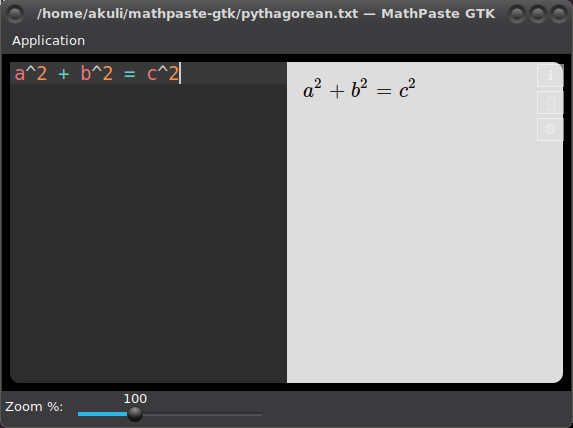

# mathpaste-gtk

This is a Gtk GUI for PurpleMyst's mathpaste that lets you save maths to text
files conveniently. You need to have an internet connection while using this.

## Setting up

These instructions are for Debian-based Linux distributions, like Ubuntu. If
you are using some other distribution, you're on your own. If you are not using
Linux yet, let me know if you actually want to run this program by creating an
issue on GitHub.

Install dependencies.

    $ sudo apt install git python3-{gi,pip} gir1.2-{gtk-3,webkit2-4}.0
    $ python3 -m pip install --user lzstring appdirs

Download the project.

    $ git clone https://github.com/Akuli/mathpaste-gtk

Run it.

    $ cd mathpaste-gtk
    $ python3 mathpaste-gtk.py

There is no more convenient way to run mathpaste-gtk yet. Let me know if you
want something nicer.
